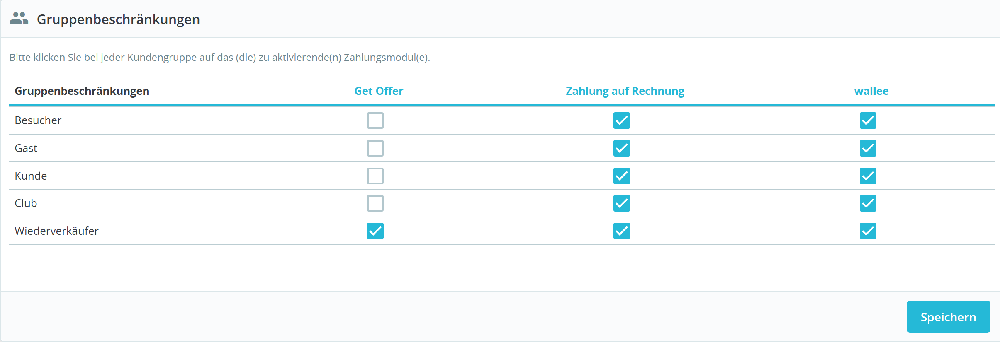

# Internauten B2B Offer

Payment module that adds a "Get Offer" payment method. Customers place the order and it is set to a pending "Awaiting Get Offer" state so you can review and respond with a custom offer.

## Features

- Adds a checkout payment method: Get Offer.
- Creates a pending order in "Awaiting Get Offer" state.
- Adds two extra order states for your workflow: "Offer accepted" and "Offer rejected".
- Custom order confirmation message for this payment method.
- Sends custom emails for "Offer accepted" and "Offer rejected" with full order details.

## Installation

1. Copy the module folder into `modules/internautenb2boffer`.
2. In the back office: Modules -> Module Manager -> install "Get Offer".
3. If upgrading from a previous name, uninstall the old module first.
4. Set the Gruppenbeschrankungen in Zahlung -> Voreinstellungen to the groups that can request offers.
   

## Usage

- Customer selects "Get Offer" at checkout and completes the order.
- The order is created with status "Awaiting Get Offer".
- You can manually switch the order to "Offer accepted" or "Offer rejected" in the order status dropdown.

Note: Uninstalling the module keeps the custom order states so historical orders remain readable.

## Debug logging toggle

The module contains temporary debug logs guarded by configuration key `INTERNAUTENB2BOFFER_DEBUG_LOGS`.

Back Office toggle: Modules -> Module Manager -> Get Offer -> Configure -> Enable debug logs.

Or direct in DB:
- Enable logging:
   ```sql
   UPDATE ps_configuration SET value = '1' WHERE name = 'INTERNAUTENB2BOFFER_DEBUG_LOGS';
   ```
- Disable logging:
   ```sql
   UPDATE ps_configuration SET value = '0' WHERE name = 'INTERNAUTENB2BOFFER_DEBUG_LOGS';
   ```
- If missing (older install), create it once:
   ```sql
   INSERT INTO ps_configuration (name, value, date_add, date_upd)
   VALUES ('INTERNAUTENB2BOFFER_DEBUG_LOGS', '1', NOW(), NOW())
   ON DUPLICATE KEY UPDATE value = '1', date_upd = NOW();
   ```

All log entries are prefixed with `[internautenb2boffer]` and can be viewed in Back Office -> Advanced Parameters -> Logs.

## Email templates

This module ships the following email templates in the module folder:

- `mails/en/offer_request.html`
- `mails/en/offer_request.txt`
- `mails/en/offer_accepted.html`
- `mails/en/offer_accepted.txt`
- `mails/en/offer_rejected.html`
- `mails/en/offer_rejected.txt`
- `mails/de/offer_request.html`
- `mails/de/offer_request.txt`
- `mails/de/offer_accepted.html`
- `mails/de/offer_accepted.txt`
- `mails/de/offer_rejected.html`
- `mails/de/offer_rejected.txt`
- `mails/fr/offer_request.html`
- `mails/fr/offer_request.txt`
- `mails/fr/offer_accepted.html`
- `mails/fr/offer_accepted.txt`
- `mails/fr/offer_rejected.html`
- `mails/fr/offer_rejected.txt`
- `mails/it/offer_request.html`
- `mails/it/offer_request.txt`
- `mails/it/offer_accepted.html`
- `mails/it/offer_accepted.txt`
- `mails/it/offer_rejected.html`
- `mails/it/offer_rejected.txt`

The module sends its custom emails from the module templates by default. If you want theme overrides, copy the templates into your active theme mail folders and customize them, for example:

- `themes/<active_theme>/mails/en/offer_request.html`
- `themes/<active_theme>/mails/en/offer_request.txt`
- `themes/<active_theme>/mails/en/offer_accepted.html`
- `themes/<active_theme>/mails/en/offer_accepted.txt`
- `themes/<active_theme>/mails/en/offer_rejected.html`
- `themes/<active_theme>/mails/en/offer_rejected.txt`
- `themes/<active_theme>/mails/de/offer_request.html`
- `themes/<active_theme>/mails/de/offer_request.txt`
- `themes/<active_theme>/mails/de/offer_accepted.html`
- `themes/<active_theme>/mails/de/offer_accepted.txt`
- `themes/<active_theme>/mails/de/offer_rejected.html`
- `themes/<active_theme>/mails/de/offer_rejected.txt`
- `themes/<active_theme>/mails/fr/offer_request.html`
- `themes/<active_theme>/mails/fr/offer_request.txt`
- `themes/<active_theme>/mails/fr/offer_accepted.html`
- `themes/<active_theme>/mails/fr/offer_accepted.txt`
- `themes/<active_theme>/mails/fr/offer_rejected.html`
- `themes/<active_theme>/mails/fr/offer_rejected.txt`
- `themes/<active_theme>/mails/it/offer_request.html`
- `themes/<active_theme>/mails/it/offer_request.txt`
- `themes/<active_theme>/mails/it/offer_accepted.html`
- `themes/<active_theme>/mails/it/offer_accepted.txt`
- `themes/<active_theme>/mails/it/offer_rejected.html`
- `themes/<active_theme>/mails/it/offer_rejected.txt`

## Template variables

You can use the following placeholders in `offer_request`, `offer_accepted`, and `offer_rejected` templates:

**Common (HTML and TXT)**

- `{firstname}`
- `{lastname}`
- `{shop_name}`
- `{shop_url}`
- `{order_name}`
- `{date}`
- `{payment}`
- `{carrier}`
- `{total_paid}`
- `{history_url}`
- `{total_products}`
- `{total_discounts}`
- `{total_wrapping}`
- `{total_shipping}`
- `{total_tax_paid}`

**HTML-only**

- `{products}`
- `{discounts}`
- `{delivery_block_html}`
- `{invoice_block_html}`

**TXT-only**

- `{products_txt}`
- `{discounts_txt}`
- `{delivery_block_txt}`
- `{invoice_block_txt}`
